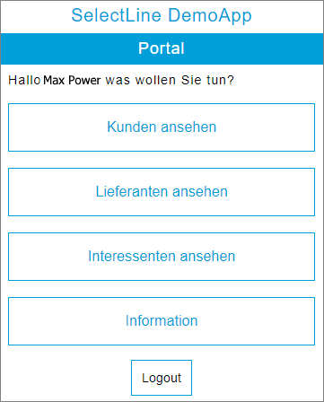

# DemoApp für die SelectLine API
Der hier veröffentlichte Code zeigt die Nutzung der **SelectLine API**. Die unten aufgeführten Funktionen werden aktuell von der DemoApp unterstützt. Die Url der "SelectLine API", welche von dieser Funktion  genutzt wird, ist ebenso vermerkt. Für alle Funktionen bietet die "SelectLine API" eine Hilfe. Siehe <http://demo.slmobile.de/demoApi/help>

#### API Informationen abrufen 
Von der API wird die Bezeichnung und Versionsnummer abgerufen.
<http://demo.slmobile.de/demoApi/>
#### Informationen zum angemeldeten Benutzer 
Der Name und weitere Informationen des angemeldeten Benutzers werden abgerufen.
<http://demo.slmobile.de/demoApi/Users/Current>
#### Login
Mit Benutzername und Passwort wird sich bei er "SelectLine API" angemeldet.
<http://demo.slmobile.de/demoApi/login>
#### Logout 
Der angemeldete Benutzer wird abgemeldet.
<http://demo.slmobile.de/demoApi/logout>
#### Kundenliste abrufen
Es wird die Liste der Kunden abgerufen.
<http://demo.slmobile.de/demoApi/customers>
#### Lieferantenliste abrufen
Es wird die Liste der Lieferanten abgerufen.
<http://demo.slmobile.de/demoApi/suppliers>
#### Interessentenliste abrufen 
Es wird die Liste der Interessenten abgerufen.
<http://demo.slmobile.de/demoApi/prospects>

## Technische Grundlagen des Projektes
Das Projekt wurde mit C#/WPF umgesetzt.

In der Klasse "Communication" in Klassen-Datei "SelectLine.Api.WPFDemo/communication.cs" ist die Url zur "SelectLine API" DemoUrl (<http://demo.slmobile.de/demoApi/>) hinterlegt. Hier kann man diese leicht umstellen auf eine Url einer selbst gehosteten "SelectLine API". Dazu muss der String in der Funktion GetApiUrl() angepasst werden.

